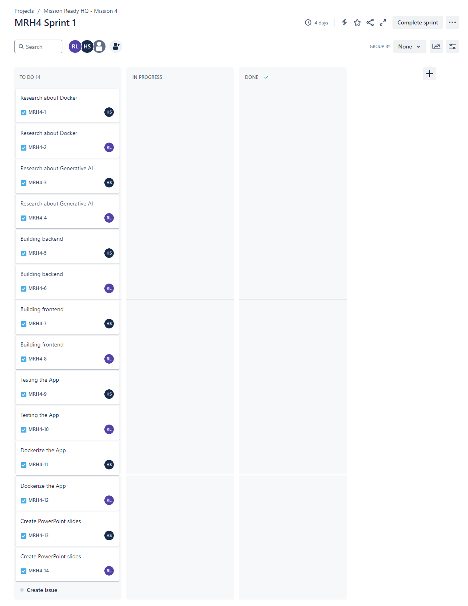
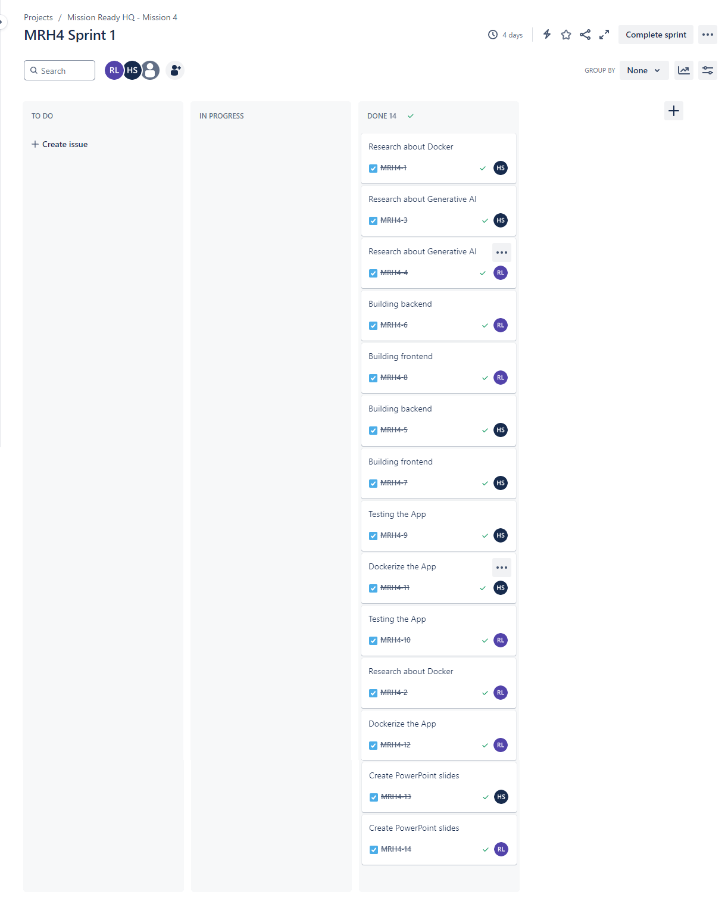

# Intro

Objective of this Web App is to chat with a user and recommend insurance policy products based on the answers of the user. 

I've used the **systemInstruction** property to set the behavior of the AI. (More information can be found at [systemInstructions](https://ai.google.dev/gemini-api/docs/system-instructions?lang=node))

## Built with 

* [SvelteKit](https://kit.svelte.dev/)
* [TypeScript](https://www.typescriptlang.org/)
* [TailWindCSS](https://tailwindcss.com/)
* [NodeJS](https://nodejs.org/en)
* [ExpressJS](https://nodejs.org/en)
* [Google Gemini API](https://aistudio.google.com/)
* [Socket.io](https://socket.io/)
* [Svelte Markdown](https://www.npmjs.com/package/svelte-markdown)
* [CSS Loaders](https://css-loaders.com/)

## Other resources
* [Google Gemini API documentation](https://ai.google.dev/gemini-api/docs)

## Instructions

Use the following command to clone the repository. 
``` 
git clone https://github.com/romeshl/Tinnie-AI-Insurance-Policy-Assistant-Mission4.git
```

You will need to create a **.env** file in the root of the Backend folder to hold the following environmental variables.

```
API_KEY=(Your google API key)
CLIENT_URL=(URL of your client eg:http://localhost:5000)
```

and then the following command to run the app in Docker
```
docker compose up --build
```
You may individually run frontend and backend by going inside each folder and using relevant docker commands. 

---

# Mission Ready HQ - Mission 4

Create an application that chats with a user and then recommends the most suitable insurance policy based on the attributes of the users. 

## Task 1. Sprint Planning
Team members of this project are [Haley](https://github.com/justhaylz) and [Romesh](https://github.com/romeshl).

## Task 2. Use JIRA to manage team tasks
JIRA board at the beginning of the project.
<br>

<br>
JIRA board at the end of the project.
<br>

<br>
## Task 3. Daily Standup
Started the meetings on 18/08/2024.

## Task 4. Create an Insurance Recommendation Application using Generative AI

This repo contains the project. You can access them by following [instructions](#instructions) above.

## Task 5. Containerise the Application

This repo contains the **compose.yml**. You can access it by following [instructions](#instructions) above.

## Task 6. Provide Feedback to UX Designers

No UX Designers were assigned.

## Task 7. Present at Show and Tell - Using Story Telling Techniques

Presenting online on 22/08/2024 from 6:00PM onwards.

## Task 8. Submit the work

Submission on 22/08/2024
